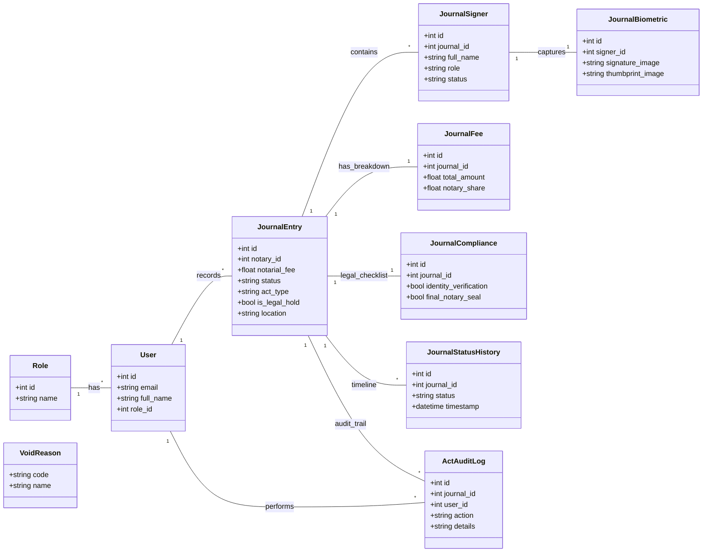

# Database Schema Documentation: Notary Journal System

This document provides a comprehensive overview of the Microsoft SQL Server (MSSQL) database schema for the Modular Notary Journal API. The schema is designed with normalization and traceability as core principles.

## 1. System Core (Identity & Access)

| Table | Purpose | Key Relationships |
|-------|---------|-------------------|
| `roles` | RBAC roles (Admin, Dispatcher, Customer) | 1:N with `users` |
| `users` | Identity management for Notaries and Admins | N:1 with `roles`, 1:N with `journal_entries` |

---

## 2. Notary Journal Lifecycle (Master-Detail)

The system uses a highly normalized structure for Journal Entries to ensure data integrity and ease of reporting.

### Master Registry
- **`journal_entries`**: The central record for a notarial act.
  - Fields: `id`, `notary_id`, `notarial_fee`, `status` (Draft, Completed, Voided), `act_type`, `is_legal_hold` (Compliance flag), `location`, `notary_notes`.
  - Relationships: 1:N with `JournalSigner`, `JournalStatusHistory`, `ActAuditLog`.

### Supplemental Modules (1:1 with JournalEntry)
- **`journal_fees`**: Detailed breakdown of the total amount charged.
  - Fields: `base_notarial_fee`, `service_fee`, `travel_fee`, `total_amount`, `notary_share`.
- **`journal_compliance`**: Legal checklist for each act.
  - Fields: `identity_verification` (bool), `mandatory_fields` (bool), `final_notary_seal` (bool).

---

## 3. Signers & Biometrics

Each notarial act can have multiple signers, each with their own biometric verification.

- **`journal_signers`**: Information about the individuals involved in the act.
  - Fields: `full_name`, `role` (Grantor, Witness), `id_number`, `status`.
  - Relationships: N:1 with `journal_entries`, 1:1 with `JournalBiometric`.
- **`journal_biometrics`**: Secure links to physical capture files.
  - Fields: `signature_image`, `thumbprint_image` (UUID-based file paths).
  - Storage: Files are stored in `/uploads` and served as static assets.

---

## 4. Traceability & Compliance

Comprehensive history tracking for auditing purposes.

- **`journal_status_history`**: Tracks every lifecycle phase of the act.
  - Fields: `status`, `timestamp`, `is_active`.
- **`act_audit_logs`**: Permanent record of *who* performed *what* action.
  - Fields: `user_name` (denormalized), `action` (CREATED, VOIDED, LEGAL_HOLD), `details`, `timestamp`.
  - *Note: Stores the `user_name` directly to preserve historical context if a user is deleted or renamed.*

---

## 5. System References

Used for standardizing dropdowns and business rules.

- **`void_reasons`**: Lookup data for canceling an act.
  - Fields: `code` (DATA_ERROR, CLIENT_REQUEST), `name`.

---

## Technical Specifications
- **Database Engine**: Microsoft SQL Server (MSSQL).
- **Naming Convention**: `snake_case` (Normalized for interoperability).
- **ORM**: SQLAlchemy 2.0 (Async).
- **Driver**: ODBC Driver 18 for SQL Server (`aioodbc`).
