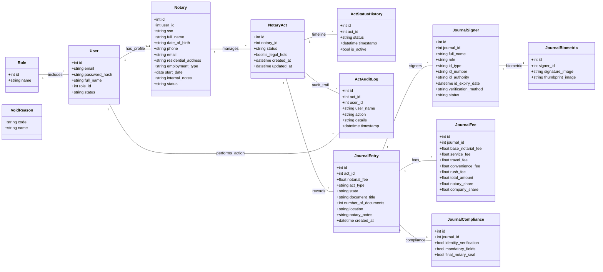

# Database Schema Documentation: Notary Journal System

This document provides a comprehensive overview of the Microsoft SQL Server (MSSQL) database schema for the Modular Notary Journal API. The schema is designed with normalization and traceability as core principles.

## 0. Identity & Professional Profiles

| Table | Purpose | Key Relationships |
|-------|---------|-------------------|
| `users` | Identity management and RBAC. | N:1 with `roles`, 1:1 with `notaries`. |
| `notaries` | Professional capacity profile (SSN, Employment). | 1:1 with `users`, 1:N with `notary_acts`. |
| `act_status_history` | Detailed historical timeline of the session status changes. | N:1 with `NotaryAct`. |
| `act_audit_logs` | Permanent audit trail of *who* performed *what* on this session. | N:1 with `NotaryAct`, N:1 with `User`. |

---

## 2. Recording Layer (Journal Entries)

The "Journal" layer handles the specific documents and signers involved in an act.

| Table | Purpose | Key Relationships |
|-------|---------|-------------------|
| `journal_entries` | The actual journal record for a document within an act. | N:1 with `NotaryAct`, 1:N with `JournalSigner`. |
| `journal_signers` | Individuals (Grantors, Witnesses) signing the document. | N:1 with `JournalEntry`, 1:1 with `JournalBiometric`. |
| `journal_biometrics` | Signature and thumbprint image pointers for a signer. | 1:1 with `JournalSigner`. |

---

## 3. Financial & Compliance

| Table | Purpose | Key Relationships |
|-------|---------|-------------------|
| `journal_fees` | Breakdown of fees (service, notary share) for a specific record. | 1:1 with `JournalEntry`. |
| `journal_compliance` | Checklist confirming legal requirements were met. | 1:1 with `JournalEntry`. |

---

## Technical Specifications
- **Database Engine**: Microsoft SQL Server (MSSQL).
- **Naming Convention**: `snake_case` (Normalized for interoperability).
- **ORM**: SQLAlchemy 2.0 (Async).
- **Driver**: ODBC Driver 18 for SQL Server (`aioodbc`).
